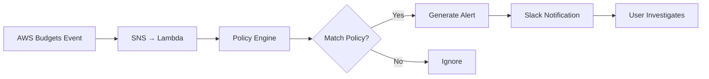
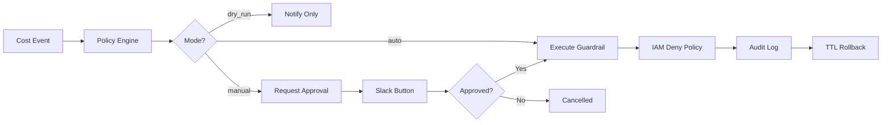

# Product Specification - AutoGuardRails

## 0. Product Vision

**AutoGuardRails** is a safety-first AWS cost management system that automatically detects cost anomalies and applies graduated, reversible guardrails to prevent runaway costs without disrupting legitimate operations.

---

## 1. Core Problem

### 1.1 The Challenge
AWS cost overruns can happen quickly and silently:
- CI/CD pipeline misconfiguration creates hundreds of EC2 instances
- Forgotten NAT Gateways running 24/7 in development accounts
- GPU instances left running after experiments
- Developers unknowingly launching resources in expensive regions

**Traditional solutions fail because:**
- Manual monitoring is reactive and slow
- Blanket restrictions prevent legitimate work
- Emergency shutdowns can break production systems

### 1.2 Our Approach
**Graduated Response**: Detect → Notify → Restrict → Rollback
- ✅ Safe by default (dry-run mode)
- ✅ Targeted actions (specific roles/services, not entire accounts)
- ✅ Automatic rollback (TTL-based)
- ✅ Always reversible (no data loss)

---

## 2. Target Users

### 2.1 Primary Personas

**Finance/FinOps Teams**
- **Need**: Early detection of cost anomalies before monthly bills arrive
- **Pain**: Can see costs but can't prevent overruns
- **Value**: Slack alerts with actionable recommendations

**SRE/Platform Teams**
- **Need**: Prevent runaway costs from CI/CD or dev environments
- **Pain**: Manual intervention required for cost incidents
- **Value**: Automated quarantine of misconfigured roles

**Startup CTOs**
- **Need**: Cost control without hiring dedicated FinOps
- **Pain**: Limited time and resources
- **Value**: 10-minute setup, immediate value

### 2.2 Anti-Personas
- Enterprise with complex multi-org setups (Phase 2+)
- Users needing multi-cloud support (out of scope)
- Users wanting predictive forecasting (different product)

---

## 3. Product Tiers

### 3.1 Free Tier (Detection & Notification)

**Features:**
- ✅ AWS Budgets integration
- ✅ Cost Anomaly Detection support
- ✅ Slack notifications (rich format with context)
- ✅ Dry-run mode (shows what would happen)
- ✅ YAML policy configuration

**Limitations:**
- No automatic actions
- No approval workflow
- No audit logs

**Target Users:** Small teams, startups evaluating the product

**Value Proposition:** "Know about cost spikes within minutes, not days"

---

### 3.2 Pro Tier (Automated Guardrails)

**Features (adds to Free):**
- ✅ IAM deny policy attachment (automatic restrictions)
- ✅ Quarantine mode (isolate specific IAM roles/users)
- ✅ Manual approval workflow (Slack button → execute)
- ✅ TTL-based automatic rollback
- ✅ Full audit trail (DynamoDB)
- ✅ Exception/allowlist support
- ✅ Time window restrictions

**Pricing:** TBD (likely usage-based or seat-based)

**Target Users:** Growing startups, small-medium teams with compliance needs

**Value Proposition:** "Stop runaway costs automatically, safely, and reversibly"

---

### 3.3 Enterprise Tier (Future)

**Planned Features:**
- Service Control Policies (SCP) for AWS Organizations
- Multi-account orchestration
- SSO integration
- Advanced analytics and reporting
- Custom integrations (PagerDuty, Jira, etc.)
- Dedicated support

---

## 4. User Stories

### 4.1 Free Tier Stories

**Story 1: Budget Alert**
```
As a finance manager,
I want to receive Slack alerts when actual spending exceeds 80% of budget,
So that I can investigate before the budget is fully consumed.

Acceptance Criteria:
- Alert sent within 5 minutes of AWS Budgets event
- Message includes: amount over budget, account ID, time period
- Link to AWS Cost Explorer for details
```

**Story 2: Anomaly Detection**
```
As an SRE,
I want to be notified when cost patterns are anomalous,
So that I can investigate potential issues early.

Acceptance Criteria:
- Integrates with AWS Cost Anomaly Detection
- Shows anomaly score, service, and region
- Provides recommended actions (dry-run suggestions)
```

---

### 4.2 Pro Tier Stories

**Story 3: CI Role Quarantine**
```
As a platform engineer,
I want CI deployment roles to be automatically restricted when costs spike,
So that misconfigured deployments don't create runaway costs.

Acceptance Criteria:
- Policy triggers when costs exceed $200/hour
- Restricts only EC2/NAT Gateway creation (not reads)
- Auto-rollback after 3 hours
- Approval option via Slack button
```

**Story 4: Manual Approval**
```
As a team lead,
I want to approve guardrail actions before they execute,
So that I have control over production impact.

Acceptance Criteria:
- Slack notification with "Approve" button
- Action executes only after approval
- Audit log records who approved and when
- Approval link expires after 1 hour
```

**Story 5: Audit Trail**
```
As a compliance officer,
I want to see a complete history of all guardrail actions,
So that I can prove due diligence during audits.

Acceptance Criteria:
- Every action logged to DynamoDB
- Log includes: who, what, when, why, how long
- Query interface (CLI or API)
- Export to CSV/JSON
```

---

## 5. Key Workflows

### 5.1 Free Tier: Detection Flow



**Steps:**
1. AWS sends budget alert to SNS
2. Lambda receives event
3. Policy Engine evaluates against policies
4. If match, generate rich Slack notification
5. User clicks link to AWS Console to investigate

**Time to Value:** 10 minutes (setup to first alert)

---

### 5.2 Pro Tier: Automatic Guardrail Flow



**Steps (Auto Mode):**
1. Cost event triggers policy match
2. Policy Engine creates action plan
3. IAM Executor attaches deny policy to target role
4. Audit Store logs action
5. TTL cleanup job auto-removes after configured time

---

## 6. MVP Definition

### 6.1 Must Have (Phase 0-2)
- ✅ AWS Budgets event integration
- ✅ Slack notifications
- ✅ Policy engine (YAML-based)
- ✅ Dry-run mode
- ✅ Manual approval workflow
- ✅ IAM deny policy executor
- ✅ Audit logging
- ✅ TTL auto-rollback

### 6.2 Should Have (Phase 3)
- Exception/allowlist support
- Cost Anomaly Detection integration
- Time window restrictions
- Multi-policy support

### 6.3 Could Have (Post-MVP)
- Web UI for policy management
- Root cause analysis
- Slack slash commands
- Email notifications

### 6.4 Won't Have (V1)
- SCP support
- Multi-cloud (Azure/GCP)
- Predictive forecasting
- SSO integration

---

## 7. Success Metrics

### 7.1 Product Metrics
- **Time to First Value**: < 15 minutes (setup to first notification)
- **False Positive Rate**: < 5% (policies triggering unnecessarily)
- **Rollback Success Rate**: > 99% (TTL cleanup works)
- **Alert Latency**: < 5 minutes (event to Slack notification)

### 7.2 Business Metrics
- **Free → Pro Conversion**: > 20%
- **Monthly Active Policies**: > 3 per user
- **Cost Savings**: > $500/month per Pro customer (self-reported)

### 7.3 Safety Metrics
- **Zero Accidental Deletions**: No data loss from guardrails
- **Zero Production Outages**: No guardrail causes downtime
- **Audit Coverage**: 100% (all actions logged)

---

## 8. Go-to-Market Strategy

### 8.1 PLG (Product-Led Growth)
1. **10-Minute Onboarding**: CloudFormation one-click deploy
2. **Immediate Value**: First alert within 15 minutes
3. **Clear Upgrade Path**: Free users see "Pro features" in notifications

### 8.2 Distribution
- AWS Marketplace listing
- GitHub repository (open source Free tier)
- Blog posts on FinOps best practices
- Slack community integrations

### 8.3 Pricing (Draft)
- **Free**: Unlimited notifications, dry-run only
- **Pro**: $99/month + $0.01 per action executed
- **Enterprise**: Custom pricing

---

## 9. Technical Constraints

### 9.1 AWS Limits
- IAM API rate limits (5 TPS for policy operations)
- Lambda timeout (15 minutes max)
- DynamoDB write capacity

### 9.2 Safety Requirements
- Default dry-run (no actions without opt-in)
- Scope minimization (never entire account)
- Easy rollback (TTL + manual)
- Mandatory audit logs

---

## 10. Roadmap

### Q1 2025: MVP (Free + Pro)
- Phase 0: Foundation
- Phase 1: Free tier
- Phase 2: Pro tier (manual approval)
- Phase 3: Auto mode + exceptions

### Q2 2025: Enterprise Features
- SCP support
- Web UI
- Advanced analytics

### Q3 2025: Scale & Ecosystem
- Multi-account orchestration
- Partner integrations
- API for custom workflows

---

## 11. Competitive Analysis

**AWS Budgets**
- ❌ No automatic actions
- ❌ Only email/SNS notifications
- ✅ Free, native AWS

**CloudHealth / CloudCheckr**
- ✅ Advanced analytics
- ❌ Expensive ($$$)
- ❌ No automatic preventive actions

**AutoGuardRails**
- ✅ Automatic, safe, reversible actions
- ✅ Fast setup (10 minutes)
- ✅ Free tier + affordable Pro
- ❌ AWS-only (for now)

---

## 12. Open Questions

1. Should we support Cost Anomaly Detection in Free tier? (Yes, decided)
2. What's the right TTL default? (3 hours, configurable)
3. Should we auto-create Slack channels? (No, user provides webhook)
4. Support for AWS Organizations in MVP? (No, Phase 4)

---

**Last Updated:** 2025-01-15
**Version:** 1.0
**Status:** Draft for MVP implementation
